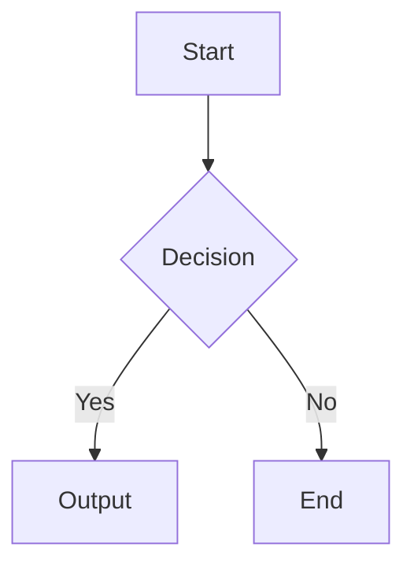

# Mermaid Example

This page contains unsupported constructs that trigger conversion warnings.

::: mermaid
sequenceDiagram
    Alice->>Bob: Hello
    Bob-->>Alice: Hi
:::

<iframe src="https://example.com/embed"></iframe>

Return to [[Introduction]] for context.
